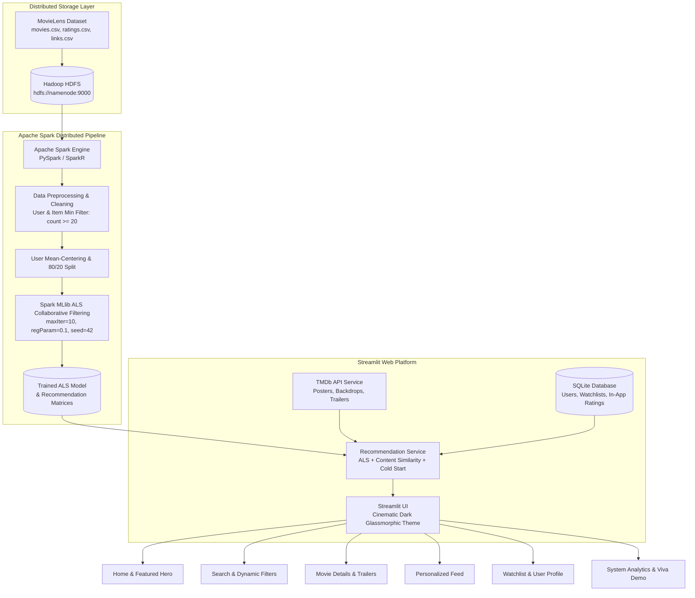

# 🎬 MovieMind: Scalable Movie Recommendation System
### Powered by Apache Spark MLlib ALS, Hadoop HDFS & Streamlit

An enterprise-grade, end-to-end **Movie Recommendation Platform** built on top of a distributed Big Data architecture (**Apache Spark + Hadoop HDFS**), serving real-time collaborative filtering predictions through a modern cinematic **Streamlit** web application enriched with **TMDb** presentation metadata.

---

## 🌟 Key Features

- ⚡ **Distributed Big Data Processing**: High-throughput distributed data ingestion and cleaning on **Hadoop HDFS** and **Apache Spark**.
- 🧠 **Spark MLlib ALS Collaborative Filtering**: Matrix factorization trained using Alternating Least Squares (`maxIter=10`, `regParam=0.1`, `nonnegative=True`, `seed=42`), achieving **RMSE ≈ 0.81** on MovieLens 32M.
- 🎯 **Dual Recommendation Engines**:
  - **Collaborative Filtering**: Spark ALS latent factor dot product for personalized user-affinity predictions.
  - **Content-Based Similarity**: High-dimensional cosine similarity over genre vector embeddings for *You May Also Like* exploration.
- ❄️ **Robust Cold-Start Handling**: Intelligent fallback pipeline for new users and guests using popularity and top-rated bayesian baselines with zero cold-start crashes.
- 🎞️ **TMDb API Enrichment**: Dynamic fetching of high-resolution posters, backdrops, cast, director, runtimes, and official YouTube trailers with disk caching and SVG fallbacks.
- 🔍 **Interactive Multi-Filter Discovery**: Sub-millisecond movie search across titles, genres, release years, and minimum star ratings.
- 👥 **User Accounts & Secure Authentication**: Registration, login, and session state backed by SQLite with salted cryptographic password hashing (`SHA-256`).
- 📑 **Persistent Watchlist & Rating History**: Rate movies (1–5 stars) and curate personal watchlists stored persistently without requiring immediate model retraining.
- 📊 **Academic System Analytics Dashboard**: Live inspection of dataset dimensions, train/test splits, ALS hyperparameters, RMSE convergence, and raw model recommendation inspectability for academic viva.
- 🌐 **Hadoop & R Integration**: Includes dedicated SparkR / native R analysis script (`spark/recommendation_hadoop_r.R`) supporting Hadoop streaming and distributed R workflows.

---

## 🏗️ Architecture



---

## 📁 Project Structure

```text
movie-recommendation-system/
│
├── spark/
│   ├── SparkNotebook.ipynb          # Distributed Spark MLlib notebook (RMSE: 0.8104)
│   ├── Notebook.ipynb               # Baseline exploratory notebook
│   ├── train_model.py               # Standalone Spark ALS training pipeline
│   ├── generate_recommendations.py  # Top-N recommendation CLI tool
│   └── recommendation_hadoop_r.R    # Academic Hadoop + R recommendation script
│
├── data/
│   ├── movies.csv                   # MovieLens movie titles and genres
│   ├── ratings.csv                  # MovieLens user ratings (1-5 stars)
│   └── links.csv                    # Mapping between MovieLens, IMDb, and TMDb
│
├── models/
│   ├── als_model/                   # Saved Spark MLlib ALS model
│   ├── als_recommendations.json     # Precomputed ALS recommendations for active users
│   └── model_metrics.json           # Model metadata, RMSE, and training timings
│
├── app/
│   ├── streamlit_app.py             # Main entry point and page routing
│   │
│   ├── pages/
│   │   ├── home.py                  # Hero banner, featured titles, ALS rows, genres
│   │   ├── search.py                # Search by title, genre, year, rating, and sort
│   │   ├── movie_details.py         # Backdrop, cast, director, trailer, ratings widget
│   │   ├── recommendations.py       # Dedicated personalized feed with explanation context
│   │   ├── watchlist.py             # User saved movies watchlist
│   │   ├── profile.py               # Authentication, user profile, rated movies history
│   │   └── analytics.py             # Big Data analytics, dataset metrics, viva tools
│   │
│   ├── components/
│   │   ├── movie_card.py            # Reusable cinematic card component
│   │   ├── movie_row.py             # Horizontal movie row / section grid
│   │   ├── navbar.py                # Top cinematic navigation header
│   │   └── sidebar.py               # Sidebar navigation and academic user simulator
│   │
│   ├── services/
│   │   ├── recommender.py           # ALS Collaborative Filtering & cold-start engine
│   │   ├── tmdb.py                  # TMDb API integration with caching & fallback
│   │   ├── movies.py                # In-memory catalog, indexing, & content similarity
│   │   └── users.py                 # SQLite database and secure password authentication
│   │
│   ├── utils/
│   │   ├── cache.py                 # Streamlit caching decorators
│   │   └── helpers.py               # Formatting and SVG placeholder poster generator
│   │
│   └── assets/
│       └── styles.css               # Dark glassmorphism & cinematic typography
│
├── config/
│   └── config.py                    # Unified configuration & environment variable loader
│
├── .env.example                     # Environment variables template
├── requirements.txt                 # Project dependencies
├── Dockerfile                       # Container definition with Python 3.11 & Java
├── docker-compose.yml               # Complete orchestration: HDFS + Spark + Streamlit
├── IMPLEMENTATION.md                # System audit and technical specification
└── README.md
```

---

## 🚀 Getting Started

### 1. Prerequisites
- **Python 3.10+** (Python 3.11 recommended)
- **Java 17 or 21** (Required for Apache Spark / PySpark)
- **Git**

### 2. Clone and Setup Environment

```bash
# Clone the repository
git clone https://github.com/Fadwahanyy/Movie_Recommendation_System.git
cd Movie_Recommendation_System

# Create and activate virtual environment
python -m venv venv

# On Windows:
venv\Scripts\activate
# On Linux / macOS:
source venv/bin/activate

# Install required dependencies
pip install -r requirements.txt
```

### 3. Configure Environment Variables

Copy the `.env.example` file to `.env`:

```bash
cp .env.example .env
```

Edit `.env` to configure your settings:
```ini
# Optional: TMDb API Key for high-resolution posters and YouTube trailers
TMDB_API_KEY=your_tmdb_api_key_here

# Apache Spark Master URL (local[*] for workstation or spark://spark-master:7077 for cluster)
SPARK_MASTER=local[*]

# Hadoop HDFS NameNode (optional, falls back gracefully to local data/)
HDFS_NAMENODE=hdfs://namenode:9000
HDFS_DATA_PATH=hdfs://namenode:9000/user/rawan/movielens

# Application Database
DATABASE_PATH=data/app_database.db
```

> **Note on TMDb**: If `TMDB_API_KEY` is not provided, the application continues to run seamlessly! Beautiful cinematic SVG posters with title and genre gradients are generated automatically on the fly.

---

## 🗄️ Hadoop HDFS Setup

To store the MovieLens datasets on a distributed Hadoop cluster:

1. **Start Hadoop HDFS Services**:
   ```bash
   start-dfs.sh
   ```
2. **Create the Target HDFS Directory**:
   ```bash
   hdfs dfs -mkdir -p /user/rawan/movielens
   ```
3. **Upload the MovieLens Datasets**:
   ```bash
   hdfs dfs -put data/movies.csv /user/rawan/movielens/
   hdfs dfs -put data/ratings.csv /user/rawan/movielens/
   ```
4. **Verify HDFS Storage**:
   ```bash
   hdfs dfs -ls /user/rawan/movielens/
   ```

---

## ⚡ Apache Spark Setup & Model Training

### Train the Spark MLlib ALS Recommendation Model

Run the standalone Spark training script:

```bash
python spark/train_model.py
```
*Or submit to a Spark cluster:*
```bash
spark-submit --master spark://spark-master:7077 spark/train_model.py
```

### Training Steps Executed:
1. Automatically verifies HDFS availability; uses `hdfs://namenode:9000` or local `data/` directory.
2. Filters low-interaction users and movies (`count >= 20`).
3. Computes mean-centering normalization.
4. Splits dataset (80% train, 20% test, `seed=42`).
5. Fits Spark MLlib `ALS(maxIter=10, regParam=0.1, coldStartStrategy="drop", nonnegative=True, seed=42)`.
6. Evaluates test set RMSE via `RegressionEvaluator`.
7. Saves the trained model and pre-computes recommendation matrices in `models/als_recommendations.json` for low-latency web serving.

### Generate Recommendations via CLI

To inspect recommendations for any user ID via terminal:

```bash
python spark/generate_recommendations.py --user 1 --n 10
```

---

## 🌐 Running the Streamlit Application

Launch the web platform with:

```bash
streamlit run app/streamlit_app.py
```

Open your browser and navigate to:
```text
http://localhost:8501
```

---

## 📊 Academic Demonstration & System Analytics

The application includes an **Academic User Simulator** and a dedicated **System Analytics** page (`app/pages/analytics.py`), specifically designed for project presentations and viva:

1. **Academic User Simulator (Sidebar)**:
   - Select known MovieLens users (User 1, 12, 148, 496, 610) to inspect real ALS predictions.
   - Select *"New User (Cold Start)"* to demonstrate cold-start fallback handling.
2. **System Analytics Dashboard**:
   - Compares the **31.7M MovieLens Big Data Benchmark** against current deployment.
   - Shows convergence metrics (RMSE: ~0.81).
   - Displays execution time breakdown (Data Ingestion, Preprocessing, ALS Training, Prediction).
   - Interactive ALS vector recommendation inspector for any User ID.

---

## 🐘 Hadoop and R Pipeline

For courses or evaluations requiring Hadoop and **R** / **SparkR**:

A complete R script is provided in [`spark/recommendation_hadoop_r.R`](spark/recommendation_hadoop_r.R):
```bash
Rscript spark/recommendation_hadoop_r.R
```
This script demonstrates:
- Connecting to Hadoop HDFS via `SparkR`.
- Distributed data manipulation and train/test splitting in R.
- Matrix factorization with `spark.als`.
- Standalone native collaborative filtering with `recommenderlab`.

---

## 🐳 Docker Deployment

To launch the full Big Data cluster (**Hadoop NameNode + DataNode + Spark Master + Spark Worker + Streamlit App**) in a single command:

```bash
docker compose up --build
```

Access the services:
- **Streamlit Web Application**: http://localhost:8501
- **Apache Spark Master Web UI**: http://localhost:8080
- **Hadoop HDFS NameNode Web UI**: http://localhost:9870

---

## 🖼️ Application Screenshots

### 1. Cinematic Home & Featured Hero
*(Hero section with blockbuster backdrop, quick search, and Spark ALS recommendations row)*

### 2. Advanced Search & Filtering
*(Filter by title, genre chips, release year slider, and minimum community rating)*

### 3. Movie Details & Official Trailers
*(High-resolution backdrop, movie synopsis, cast, director, rating widgets, and 'You May Also Like' row)*

### 4. Dedicated Recommendations Feed
*(User taste profile context: "Because you liked [Titles...], We recommend [Spark ALS predictions]")*

### 5. Big Data System Analytics
*(Academic benchmark comparison, RMSE metrics, architecture flow diagram, and live ALS inspector)*

---

## 📜 License & Acknowledgments

- **MovieLens Datasets**: Provided by [GroupLens Research](https://grouplens.org/datasets/movielens/) at the University of Minnesota.
- **TMDb**: Movie metadata and media assets provided by [The Movie Database (TMDb)](https://www.themoviedb.org/).
