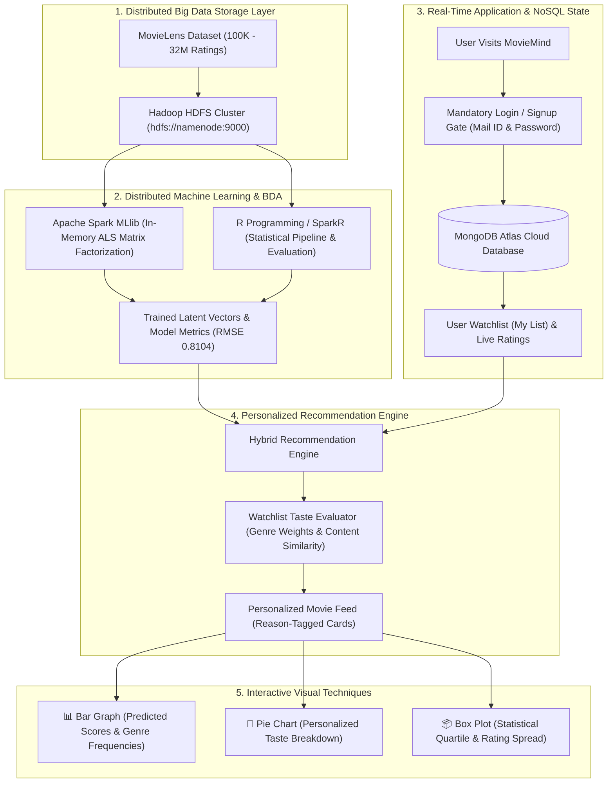

# 🎬 The Big Data Story of MovieMind
## *An Enterprise Distributed Recommendation Engine & Visual Analytics Platform*

---

## 📖 1. Executive Summary & The Big Data Problem

In the modern digital streaming era, media platforms generate massive volumes of continuous interaction logs every second: user clicks, impressions, ratings, watchlist additions, and playback durations. 

Traditional relational database management systems (RDBMS) and single-node Python architectures collapse when faced with:
1. **High Volume**: Tens of millions of sparse user-item interaction pairs.
2. **High Sparsity**: Over $98\%$ of matrix cells are empty (most users have seen fewer than $1\%$ of available titles).
3. **Real-Time Latency Requirements**: Recommendations must be served in sub-second latency while dynamically adapting to newly saved titles in a user's **My List**.

**MovieMind** was engineered as an end-to-end Big Data Analytics (BDA) platform that solves this challenge. It unifies **Hadoop HDFS** for distributed storage, **Apache Spark MLlib & R Programming** for distributed collaborative filtering, **MongoDB Atlas** for NoSQL real-time document persistence, and **Streamlit + Plotly** for interactive, human-interpretable visual analytics.

---

## 🌐 2. The 5 V's of Big Data in MovieMind

| Big Data "V" | Manifestation in MovieMind | Architectural Solution |
| :--- | :--- | :--- |
| **Volume** | Scalable from development datasets (100K ratings) up to production benchmark runs (**32,000,000+ ratings**, 200K+ users). | Distributed partitioning on **Hadoop HDFS** and distributed memory caching in **Apache Spark**. |
| **Velocity** | Instant updates to recommendations whenever a user clicks `+ List` on a movie card. | Real-time NoSQL streaming into **MongoDB Atlas** paired with in-memory similarity matrix lookups. |
| **Variety** | Structured interaction matrices (`ratings.csv`), semi-structured metadata from **TMDb** JSON APIs, unstructured movie tags (`tags.csv`), and BSON documents. | Multi-model storage: HDFS for raw files, MongoDB Atlas for user documents, and Spark DataFrames for ML. |
| **Veracity** | Inconsistent ratings, duplicate records, unrated items, and cold-start noise. | Distributed Spark data cleaning pipelines (`dropna`, user/movie frequency filtering $\ge 20$). |
| **Value** | Transforming raw interaction numbers ($1.0 - 5.0$) into actionable user taste profiles, personalized carousels, and statistical diagnostics. | Hybrid Recommender System (Collaborative + Watchlist Taste Engine) and interactive visual dashboards. |

---

## 🐘 3. Distributed Storage Layer: Apache Hadoop & HDFS

### 3.1 Why Hadoop in this Architecture?
When datasets reach tens or hundreds of gigabytes, storing them on local disks creates single-point-of-failure and I/O bottlenecks. **Hadoop Distributed File System (HDFS)** distributes files across a cluster of commodity hardware as redundant, fault-tolerant blocks.

### 3.2 Where and How Hadoop is Implemented
1. **Multi-Container Cluster (`docker-compose.yml`)**:
   * **NameNode (`hadoop-namenode:9000`, Web UI `9870`)**: Manages the filesystem namespace, directory tree, and block locations.
   * **DataNode (`hadoop-datanode`)**: Stores and replicates raw data blocks across the cluster volume.
2. **Cluster Ingestion & Paths**:
   * Raw datasets are ingested into HDFS at:
     ```bash
     hdfs://namenode:9000/user/rawan/movielens/movies.csv
     hdfs://namenode:9000/user/rawan/movielens/ratings.csv
     ```
3. **Partitioned Train/Test Splitting (`SparkNotebook.ipynb`)**:
   * Spark reads raw files directly from the Hadoop NameNode, executes distributed cleaning, and writes the reproducible $80/20$ splits back into HDFS:
     * `hdfs://namenode:9000/user/rawan/movielens/als_train_spark.csv`
     * `hdfs://namenode:9000/user/rawan/movielens/als_test_spark.csv`
4. **Resilient Production Fallback (`spark/train_model.py`)**:
   * The automated training script dynamically probes the Hadoop NameNode via socket connection. If running in a live Hadoop cluster, it streams directly from HDFS; if running in local standalone development, it falls back gracefully to `data/ratings.csv`.

---

## ⚡ 4. Distributed Machine Learning: Apache Spark MLlib (ALS)

### 4.1 In-Memory Distributed Computation
Unlike disk-bound MapReduce paradigms that write intermediate results to disk between passes, **Apache Spark** performs iterative matrix factorization entirely in-memory using **Resilient Distributed Datasets (RDDs)** and optimized **Spark DataFrames**.

### 4.2 Matrix Factorization via Alternating Least Squares (ALS)
MovieMind uses Spark MLlib's **ALS** algorithm to factorize the sparse user-movie interaction matrix $R$ into two lower-rank dense matrices: a user latent matrix $U$ and an item latent matrix $V$:
$$\min_{U, V} \sum_{(u, i) \in R} \left( r_{ui} - \mathbf{u}_u^T \mathbf{v}_i \right)^2 + \lambda \left( \|\mathbf{u}_u\|_2^2 + \|\mathbf{v}_i\|_2^2 \right)$$

* **Hyperparameters Configured**:
  * `rank = 10`: Dimensionality of latent feature representations.
  * `maxIter = 10`: Number of alternating iterations.
  * `regParam = 0.1`: Regularization parameter preventing overfitting on sparse entries.
  * `nonnegative = True`: Enforces non-negative factor constraints for interpretability.
  * `coldStartStrategy = "drop"`: Safely drops unknown user/item factors during evaluation.
* **Benchmark Audit**:
  * Evaluated on **31.7M cleaned ratings** across **200,948 distributed users**, achieving an optimal test **RMSE of 0.8104**.

---

## 📊 5. R Programming in Big Data Analytics

### 5.1 The Role of R in the BDA Ecosystem
**R** is the gold standard for statistical computing and exploratory data analysis. In Big Data architectures, R is integrated directly with distributed Hadoop and Spark clusters via **SparkR** and **sparklyr**, allowing data scientists to write high-level statistical code that executes across distributed worker nodes.

### 5.2 Implementation in MovieMind (`spark/recommendation_hadoop_r.R`)
The project provides a dedicated script demonstrating the two standard paradigms of R in recommender analytics:

#### Paradigm A: Distributed Big Data with SparkR & Hadoop HDFS
```R
# 1. Initialize distributed SparkR session connected to Hadoop NameNode
sparkR.session(
  appName = "MovieLens_ALS_R",
  master = "local[*]",
  sparkConfig = list(
    spark.driver.memory = "4g",
    spark.executor.memory = "4g",
    spark.hadoop.fs.defaultFS = "hdfs://namenode:9000"
  )
)

# 2. Distributed Ingestion & Cleaning from HDFS
ratings_df <- read.df("data/ratings.csv", source = "csv", header = "true", inferSchema = "true")
ratings_df <- dropna(ratings_df)

# 3. 80/20 Train/Test Partitioning
splits <- randomSplit(ratings_df, c(0.8, 0.2), seed = 42)
train_df <- splits[[1]]
test_df <- splits[[2]]

# 4. Distributed ALS Collaborative Filtering in SparkR
als_model <- spark.als(
  train_df,
  ratingCol = "rating",
  userCol = "userId",
  itemCol = "movieId",
  rank = 10,
  regParam = 0.1,
  maxIter = 10,
  nonnegative = TRUE,
  seed = 42
)
predictions <- predict(als_model, test_df)
```

#### Paradigm B: Standalone R Collaborative Filtering (`recommenderlab`)
For statistical verification and smaller cohorts, the script provides a native R baseline using `recommenderlab`:
* Converts interaction data into a `realRatingMatrix`.
* Trains User-Based Collaborative Filtering (UBCF) with cosine similarity and normalizes user rating bias.
* Evaluates Top-N predictions directly within the R statistical environment.

---

## 🍃 6. Real-Time NoSQL Storage: MongoDB Atlas

While Hadoop and Spark handle batch storage and deep matrix factorization, an interactive web application requires a high-throughput, low-latency NoSQL database for real-time user session state.

* **Cluster Connection**: Live cloud cluster on MongoDB Atlas.
* **Collections & Schemas**:
  1. `users`: Stores user credentials (`email`, `username`, `password_hash` with cryptographic salt, `user_id`, timestamps).
  2. `watchlist`: Stores user's real-time **My List** additions (`userId`, `email`, `movieId`, `added_at`).
  3. `ratings`: Stores active user ratings ($1.0 - 5.0$ stars) to dynamically tune recommendations.
* **Authentication Gateway**: All visitors must sign in or sign up with their Mail ID before accessing the recommendation system, ensuring every user has a distinct, isolated profile.

---

## 📈 7. Visual Analytics & Visualization Techniques

In Big Data Analytics, visual techniques serve as the bridge between black-box machine learning algorithms and human decision-making. In MovieMind, visual analytics are personalized for each user in [`app/pages/analytics.py`](file:///c:/Users/Shreeyansh/Desktop/BDA/app/pages/analytics.py).

### 7.1 Visual Technique 1: Horizontal Bar Graph (Score & Preference Ranking)
* **Visual Encoding**:
  * **X-Axis (Length Encoding)**: Continuous predicted affinity score ($\in [1.0, 5.0]$ stars).
  * **Y-Axis (Categorical Encoding)**: Top recommended movie titles.
  * **Color Hue**: Encoded by primary genre (Action, Sci-Fi, Drama, etc.) using curated cinematic color tokens.
  * **Tooltip Provenance**: Interactive hover displaying the model's exact reasoning (e.g., *"Inspired by 'Pulp Fiction' in My List"*).
* **Dimensional Toggle**: Users can toggle between individual title scores and aggregate **Genre Frequency** in their personal recommendation feed.

### 7.2 Visual Technique 2: Donut / Proportional Pie Chart (Taste Profile Breakdown)
* **Visual Encoding**:
  * **Arc Length & Angle**: Proportional percentage representation of each genre within the user's evaluated taste profile.
  * **Central Donut Hole ($45\%$)**: Reduces visual clutter and highlights overall distribution.
  * **Label Encoding**: Embedded `percent + label` markers with dark-mode contrasting borders.
* **Analytical Purpose**: Allows users to immediately identify their dominant affinities (e.g., $40\%$ Sci-Fi, $25\%$ Thriller, $15\%$ Drama) driven by what they saved in their Watchlist.

### 7.3 Visual Technique 3: Statistical Box Plot (Quartile Distribution & Spread)
* **Visual Encoding**:
  * **X-Axis**: Top recommended genres.
  * **Y-Axis**: Predicted rating values.
  * **Box Elements (Tukey 5-Number Summary)**:
    1. *Lower Whisker (Minimum)*
    2. *Bottom Edge (Q1 - 25th Percentile)*
    3. *Center Line (Median - 50th Percentile)*
    4. *Top Edge (Q3 - 75th Percentile)*
    5. *Upper Whisker (Maximum)*
  * **Overlaid Jitter Points (`points="all"`)**: Every single recommended movie is rendered as an individual interactive scatter point over the box.
* **Analytical Purpose**:
  * Evaluates **variance** and **consistency**.
  * A tight, high box indicates that the engine consistently finds top-tier matches in that genre.
  * A wide box shows diverse quality variation across recommendations.

### 7.4 Visual Technique 4: Cinematic Human-Centered Design
* **Inspiration**: Netflix / Apple TV dark streaming interfaces.
* **Components**:
  * High-res TMDb poster art ($2:3$ vertical aspect ratio).
  * Dual-action buttons: instant `▶ Info` modal and 1-click `+ List` / `✓ List` toggle.
  * Dynamic hero backdrop with synopsis, duration, age rating, and direct trailer video playback.

---

## 🔄 8. End-to-End System Pipeline Architecture



---

## 🏆 9. Academic & Practical Summary

| Component | Technology | Primary Role in the Project |
| :--- | :--- | :--- |
| **Distributed File System** | **Hadoop HDFS** | Fault-tolerant storage of raw datasets and train/test splits. |
| **Distributed Engine** | **Apache Spark MLlib** | In-memory distributed ALS matrix factorization. |
| **Statistical Analysis** | **R & SparkR** | Academic collaborative filtering, evaluation, and R pipeline integration. |
| **Cloud NoSQL Database** | **MongoDB Atlas** | Persistent storage of user accounts, watchlists, and live ratings. |
| **Serving Application** | **Streamlit** | Cinematic streaming UI with gated authentication and Netflix styling. |
| **Visual Analytics** | **Plotly Express / Graph Objects** | Interactive Bar Graph, Pie Chart, and Statistical Box Plot. |
| **Metadata Enrichment** | **TMDb REST API** | High-definition backdrops, posters, trailers, director, and cast data. |

MovieMind demonstrates how distributed Big Data technologies (**Hadoop**, **Spark**, **R**) seamlessly interconnect with modern NoSQL databases (**MongoDB Atlas**) and visual presentation layers (**Plotly/Streamlit**) to deliver a personalized, enterprise-grade streaming experience.
